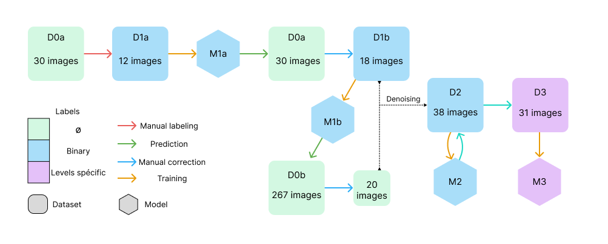

# Spinal-Rootlets Segmentation on T2w Images

## 1) Project Overview

The goal of this project is to develop a deep learning (DL)-based method to segment and locate the spinal rootlets.

## 2) Work Done

### A) Literature and Data Review

No articles were found on this topic.

After reviewing the available
datasets ([issue#1](https://github.com/ivadomed/model-spinal-rootlets/issues/1#issue-1706345176)), it was determined
that none of them were suitable.

### B) Dataset Creation

Initially, the plan was to test with a binary label (0: no rootlet, 1: rootlet). In the following text, the datasets
will be numbered as D1, D2, etc., and the models as M1, M2, etc.



Datasets summary:

| name | number images          | link                                                                 | labels         |
|------|------------------------|----------------------------------------------------------------------|----------------|
| D0a  | 30(10x3 sessions)      | [open neuro](https://openneuro.org/datasets/ds004507/versions/1.0.1) | No             |
| D0b  | 267                    | [spine-generic](https://github.com/spine-generic/data-multi-subject) | No             |
| D1a  | 12                     |                                                                      | Binary         |
| D1b  | 18                     |                                                                      | Binary         |
| D2   | 38 (20 from D0b + D1b) |                                                                      | Binary         |
| D3   | 31                     |                                                                      | Level specific |

#### D1a)

Dataset D1a was constructed with 12 subjects manual labeled (binary) from D0a.
12 MRIs from 6 subjects (3 female, 3 male), 2 sessions per subject one with normal neck flexion and one with neck
extension. The mean age is 22.5 y.o with a standard deviation of 0.52. Isotropic resolution of 0.6 (only one has a
resolution of 0.7).
Training of one nnUNet fold 3d_fullres model (M1a), 50 epochs was enough to reach a plateau around a dice score of
0.51.

> Refer to [issue#5](https://github.com/ivadomed/model-spinal-rootlets/issues/5).

#### D1b)

M1a was used to predict the D0a 20 subject. After a manual review, two images have been dropped because of
unsatisfactory quality (XX, XX).
This new dataset D1b is composed of 18 MRIs from 10 subjects, 2 sessions (3 female, 7 male). Mean age 22.9 y.o, STD
1.21. Isotropic resolution of 0.6 (only one has a resolution of 0.7).

A five-fold training of nnUNet 3d_fullres model (M1b) has been conducted for 250 epochs, dice scores were between 0.52
and 0.6. I tried the post-processing command of nnUNet but no possible improvement was found so post-processing is
useless in this case.

Inference with M1b has been conducted on the full D0b dataset.

> Refer to [issue#7](https://github.com/ivadomed/model-spinal-rootlets/issues/7)

#### D2)

Inference was further conducted on T2w data from 267 subjects from
the [spinegeneric](https://github.com/spine-generic/data-multi-subject#spine-generic-public-database-multi-subject)
A manual review of the D0b prediction made with M1b has led to a consequent number of images dropped. To help with the
manual labeling I used SCT to denoise images. Some centers have image specificity that made the manual reviewing really
hazardous and I preferred to only take images where I had a good confident level on my labels.

Only 20 subjects from D0b have been kept and merged with D1b. In this new dataset of 38 subjects (D2) 2 subjects (
randomly chosen) were moved from the training dataset to the test dataset (XXX, XXX).
D2 is composed

A five-fold training of nnUNet 3d_fullres model (M2) has been conducted for 1000 epochs, dice scores were between 0.XX
and 0.XX. No post-processing increased the score in this case.

Inference on the D2 dataset with M2 model helped me to correct my label and improve the D2 ground truth quality.

> Refer to issue [issue#8 part 2)](https://github.com/ivadomed/model-spinal-rootlets/issues/8).

#### D3)

A new labeling of the D2 dataset with spinal level-depending values has been conducted. XX images were dropped because
of uncertainty. Dataset D3 is composed of XX images ... with spinal level-specific spinal nerve segmentation.

A five-fold training of nnUNet 3d\_fullres model has been conducted for 1000 epochs, dice scores were between 0.XX and
0.XX. No post-processing increased the score in this case. After looking at the progress.png graph a new training with
2000 epochs has been done because it seems that the plateau has not been reached with 1000 epochs. This second training
led to dice score between XX and XX.

> Refer to [issue#8 part 3)](https://github.com/ivadomed/model-spinal-rootlets/issues/8).

### C) Reproduce

In the next section, all the instructions to reproduce the label files used in the final dataset will be described.
However, label files are also available here (give to dataset with root_label).

nnUNet is used to train model but the dataset format is not BIDS. I have created/modified 4 script
available [here](https://github.com/ivadomed/utilities):

- From BIDS to nnUNet #new link after PR merged
- From nnUNet to BIDS #new link after PR merged
- Extract all image from bids to nnUNet inference #new link after PR
- Merge nnUNet dataset #add link after PR merged

On [this repo](https://github.com/ivadomed/utilities) there is also help to run nnUNet commands.

#How to ewplain FLSEYES labeling ?

#### i) Reproduce D1a, M1a and D1b, M1b

Clone the original dataset D0a

```
git clone https://github.com/OpenNeuroDatasets/ds004507.git
```

This dataset is composed of 10 subject with 3 session per subject. Each session have a different neck position Up, Down,
Normal. We will not use Down position because nerve rootlets are really hard to see on this type of neck flexion.

Linked to [issue#5](https://github.com/ivadomed/model-spinal-rootlets/issues/5)

With FSLeyes, manually segment the following files:
<details>
<summary>12 first images to label</summary>
```
sub-002_ses-headNormal_T2w_root-manual.nii.gz	
sub-002_ses-headUp_T2w_root-manual.nii.gz	
sub-003_ses-headNormal_T2w_root-manual.nii.gz
sub-003_ses-headUp_T2w_root-manual.nii.gz
sub-004_ses-headNormal_T2w_root-manual.nii.gz	
sub-004_ses-headUp_T2w_root-manual.nii.gz
sub-005_ses-headNormal_T2w_root-manual.nii.gz
sub-005_ses-headUp_T2w_root-manual.nii.gz
sub-006_ses-headNormal_T2w_root-manual.nii.gz
sub-006_ses-headUp_T2w_root-manual.nii.gz
sub-007_ses-headNormal_T2w_root-manual.nii.gz
sub-007_ses-headUp_T2w_root-manual.nii.gz
```
</details>

> You can use the `json_write.py` script to add the json file according to the .nii.gz file created

Now convert this BIDS dataset to a nnUNet dataset `link to command script`.
This is the D1a dataset (100% train image no test image), composed of 12 images

Add the
<details>
<summary>dataset.json</summary>
```
{
    "channel_names": {
        "0": "T2w"
    },
    "labels": {
        "background": 0,
        "label": 1
    },
    "numTraining": 12,
    "file_ending": ".nii.gz",
    "overwrite_image_reader_writer": "SimpleITKIO"
}
```
</details>

Train model D1a with : `CUDA_VISIBLE_DEVICES=XXX nnUNetv2_train DATASETID 3d_fullres 0`

> You can stop when the progress.png reach a plateau (approx 250)

Out nnUNet Dice score from `progress.png` was around 0.52.
Now extract all image from D0a with `command line extract`.

Predict all the segmentation of D0a dataset with the model M1a
with `nnUNetv2_predict -i PATH_TO:imagesTs -o PATH_TO:Out_directory -d DATASETID -c 3d_fullres --save_probabilities -chk checkpoint_best.pth`

Manually review the predicted labels.
Note: subjects `sub-006-headNormal` and `sub-009-headNormal` have been dropped since they did not satisfy the quality.

Linked to [issue#7](https://github.com/ivadomed/model-spinal-rootlets/issues/7)
For training add
<details>
<summary>dataset.json</summary>
```
{
    "channel_names": {
        "0": "T2w"
    },
    "labels": {
        "background": 0,
        "label": 1
    },
    "numTraining": 18,
    "file_ending": ".nii.gz",
    "overwrite_image_reader_writer": "SimpleITKIO"
}
```
</details>

Now you have a dataset with 18 subject we call this one D1b

Train nnUNet model M1b with `CUDA_VISIBLE_DEVICES=XXX nnUNetv2_train DATASETID -tr nnUNetTrainer_250epochs -f 0`, repeat
for fold 1, 2, 3, 4.

Out nnUNet Dice score from `progress.png` was between 0.52 and 0.6.

#### ii) Reproduce D2, M2

Linked to [issue#8 part 2)](https://github.com/ivadomed/model-spinal-rootlets/issues/8)

Clone the original dataset D0b

```
git clone git@github.com:spine-generic/data-multi-subject.git
#specify version
```

Extract all T2w images with `extract command line`

Predict all the segmentation of D0b dataset with the model M1b
with `nnUNetv2_predict -i PATH_TO:imagesTs -o PATH_TO:Out_directory -d DATASETID -tr nnUNetTrainer_250epochs -c 3d_fullres --save_probabilities -f 0 1 2 3 4`

With FSLeyes, manually correct the following files:
<details>
<summary>12 first images to label</summary>
```
XXX
```
</details>

> I skipped some center because the quality was not good enough to ensure a good manual correction.

#convert to BIDS ?

Merge with D1b to create D2, take mri `XX` and `XX`and put them into `imagesTs` and `labelsTs`

Train nnUNet model M2 with `CUDA_VISIBLE_DEVICES=XXX nnUNetv2_train DATASETID -f 0`, repeat
for fold 1, 2, 3, 4.

Out nnUNet Dice score from `progress.png` was between GET VALUE ON DUKE.

Since this point we introduce new metric to evaluate the model more detail
in [issue#8](https://github.com/ivadomed/model-spinal-rootlets/issues/8):

- Z-axis F1 score
- Mean common F1 score

#### iii) Reproduce D3, M3

Linked to [issue#8 part 3)](https://github.com/ivadomed/model-spinal-rootlets/issues/8)

Before we used a binary labeling. But some spinal level are overlapping. One of the solution is to label spinal rootlets
depending on their spinal level (C2->2 .. T1->9).
I have manually corrected and change the value of segmentation of the following files:
<details>
<summary>31 spinal level specific value</summary>
```
XXX
```
</details>

This dataset D3 composed of 33 images with 31 for train .
I have trained 4 folds of a nnUNet 3d_fullres model
Out nnUNet Dice score from `progress.png` was between GET VALUE ON DUKE.

#compare results with binary
#Use PDF report and denoise to review manual correction

#### iv) Get our dataset

#Link to dataset D1b, D2, D3 already done, make one release per dataset ?

## 3) Results

Results and other tools created : 

## 4) Discussion

#### TODO

- [x] Explain new metrics
- [x] Choose the suffix
    - `sub-XXX_CONTRAST_label-rootlet.nii.gz`
    - `sub-XXX_ses-XXX_CONTRAST_label-rootlet.nii.gz`
- [ ] Push labeled files
- [ ] Explore softseg value
- [ ] Clean script on repo
- [x] Create script to highlight spinal levels 
  - `rootlet_to_level.py`
- [x] Compare results with Cadotte and frostel 
  - `segment_to_csv.py` 
  - `calc_all.py`
  - [issue#10](https://github.com/ivadomed/model-spinal-rootlets/issues/10)
- [ ] Improve thoracic level segmentation 